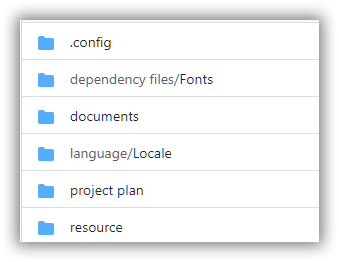
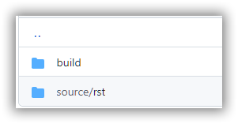

Overview
========

This is an overview document that follows on from the Documentation report issued last week.

This content is produced in RST_ (reStructuredText), but could also have equally been produced
in Markdown_ although RST is more versatile and produces better looking web content.

.. _RST: https://docutils.sourceforge.io/docs/ref/rst/introduction.html
.. _Markdown: https://daringfireball.net/

RST has many advanced features, too many to list in this introductory document,
but I will detail some within this content. One useful feature is the ability to include
content from other sources by using the `include` directive.

The include directive looks like this::

    ..include:: demo.txt

The include will only display in a compiled HTML file, so in Github there will be a blank 
space below (where the include statement sits):

.. include:: demo.txt

Objective
---------

This content is here to show some of the features of RST and Sphinx, but its main
purpose is to give you something to review and comment on.

.. note:: RST is very sensitive about white space. It may be better to add
 comments/changes to the pdf version of the file rather than the RST itself

Tools
-----

Several software tools are being used in the creation of content:

* Sublime Text - the editor used for RST content
* MarkdownPad2 - the editor used for Markdown content
* Sphinx - the static site generator (HTML)
* Sphinx-intl -the localisation add in for Sphinx (to produce translation files)
* RST2PDF - the generator used to produce PDF files
* Pandoc - for conversion of files (e.g., from RST to .docx)
* Vale - a linter and style checker

With the exception of Sublime Text and MarkdownPad2, all the other tools are
Linux CLI (command line) tools.

Features
--------

A few features of RST:

Tables:

====================  ==========  ==========
Header row, column 1  Header 2    Header 3
====================  ==========  ==========
body row 1, column 1  column 2    column 3
body row 2            Cells may span columns
====================  ======================

==========================   ====================
Image                        Description 
==========================   ====================
.. image:: electricity.png   Dangerous voltage
==========================   ====================

Admonitions:

.. warning:: This is some warning text

.. attention:: This is some text to draw attention

You can also create custom admonitions:

==========================   ======================================
.. image:: electricity.png   Warning! Dangerous voltage present
==========================   ======================================

.. admonition:: Custom

   This is a custom admonition

Code:

Code can be displayed in a number of ways. In a table:

+----------------------------------+----------------------------------+
| Code 1                           | Code 2                           |
+----------------------------------+----------------------------------+
| .. code-block:: c                | .. code-block:: c                |
|    :caption: foo.c               |    :caption: bar.c               |
|                                  |                                  |
|    extern int bar(int y);        |    extern int foo(int x);        |
|    int foo(int x)                |    int bar(int y)                |
|    {                             |    {                             |
|       return x > 0 ? bar(x-1)+1  |       return y > 0 ? foo(x-1)*2  |
|                    : 0;          |                    : 0;          |
|    }                             |    }                             |
+----------------------------------+----------------------------------+

or in a code block:

..  code-block:: php
    :caption: EXT:site_package/Configuration/TCA/Overrides/sys_template.php

    /**
     * Add default TypoScript (constants and setup)
     */
    \TYPO3\CMS\Core\Utility\ExtensionManagementUtility::addStaticFile(
         'site_package',
         'Configuration/TypoScript',
         'Site Package'
    );

Emphasis:

**Bold**

*Italic*

`Interpreted` text

Footnotes or endnotes [1]_

Mathematics:

RST, Sphinx and RST2PDF all have support for mathematics and complex formulae.

A couple of examples - 

.. math::

   y-y_0=m(x-x_0)

.. math:: 

   {J(\theta) =\frac{1}{2m} [\sum^m_{i=1}(h_\theta(x^{(i)}) - y^{(i)})2 + \lambda\sum^n_{j=1}\theta^2_j}]

Other Content
-------------

If you browse through the repository, you will find several other directories.

Browse through then to see the content. The **'.config'** directory only contains a single
file ``conf.py``, which is the configuration file for Sphinx. The **'language'** directories
will contain the gettext strings for translation.

Within the **'documents'** directory are some other sub-directories of interest:

You are already in the **'source'** directory (and there is a Markdown file included in 
the **'md'** subdirectory for comparison), but the **'build'** directory
contains the html and pdf versions of the RST source files. Take a look at both sets of files
to get a feel for how content will ber produced.

GitHub will give a preview of the pdf file (but none of the links will work), and will 
display the code for the HTML files, not the content. A zip file **'html-docs.zip'**
can be downloaded to allow viewing the HTML content as intended.

.. important:: The HTML and PDF content are not yet styled and are using default settings

More Detail
------------

The other pages in this demo content are **'guide.rst'** (a fairly long document that 
details many of the features of RST), and **'example.rst'** (an example of a 
very boring Markdown file converted to RST using pandoc).

.. [1] A footnote or endnote
